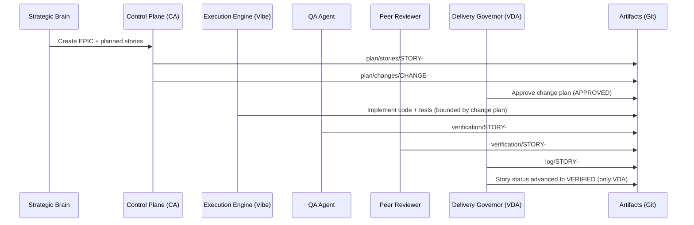
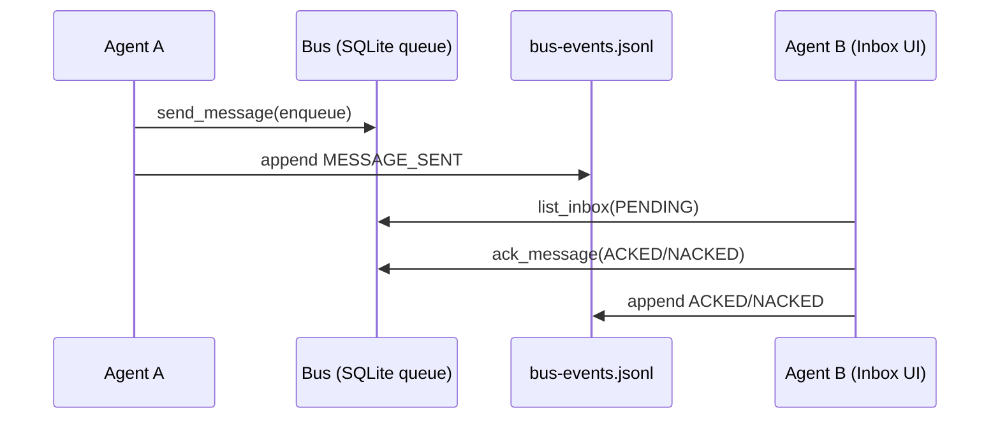

# GADOS Architecture

This document is the **merge-clean architecture narrative** for GADOS, including diagrams.

## Source of truth
Constraints and definitions live in:
- `/gados-project/memory/FOUNDATION.md`
- `/gados-project/memory/DESIGN_PRINCIPLES.md`
- `/gados-project/memory/ARCH_RULES.md`
- `/gados-project/memory/COMM_PROTOCOL.md`
- `/gados-project/memory/VERIFICATION_POLICY.md`
- `/gados-project/memory/NOTIFICATION_POLICY.md`

## C4: Context

```mermaid
flowchart LR
  Human[Human Authority]
  SB[Strategic Brain]
  CA[GADOS Control Plane (CA)]
  VDA[Delivery Governor (VDA)]
  QA[QA Agent]
  PR[Peer Reviewer]
  Repo[(Git Repo Artifacts)]
  LGTM[(Grafana LGTM / SaaS OTLP)]

  Human -->|Escalations & approvals| CA
  SB -->|Epic plans & economics inputs| CA
  CA -->|Creates/updates| Repo
  QA -->|Evidence packages| Repo
  PR -->|Review reports| Repo
  VDA -->|Verification decisions| Repo

  CA -->|OTel: traces/metrics/logs| LGTM
  CA -->|Agent bus messages| CA
```

## C4: Container view

```mermaid
flowchart TB
  subgraph Repo[Repository (versioned artifacts)]
    GProj[gados-project/ (memory/plan/log/verification/decision)]
    GCP[gados-control-plane/ (FastAPI GUI + LangGraph)]
  end

  subgraph Runtime[Runtime]
    GUI[FastAPI Control Plane]
    Bus[Agent Bus (SQLite queue)]
    Logs[Append-only bus log (JSONL)]
    LGraph[LangGraph Agent Workflows]
  end

  subgraph Obs[Observability]
    OTLP[OTLP HTTP endpoint]
    Grafana[Grafana (Explore)]
    Tempo[Tempo traces]
    Loki[Loki logs]
    Mimir[Mimir metrics]
  end

  GUI --> Bus
  Bus --> Logs
  LGraph --> GUI
  GUI --> GProj
  LGraph --> GProj
  GUI --> OTLP
  OTLP --> Tempo
  OTLP --> Loki
  OTLP --> Mimir
  Grafana --> Tempo
  Grafana --> Loki
  Grafana --> Mimir
```

## Sequence: Story lifecycle (intent → verified)



## Sequence: Agent bus (durable comms)



