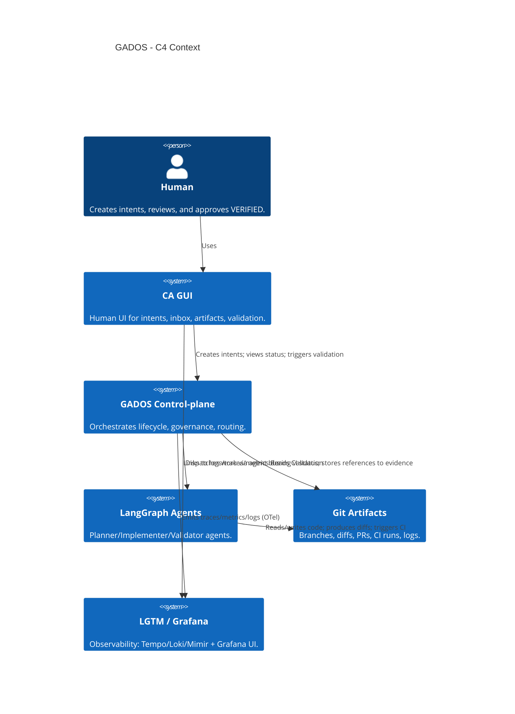
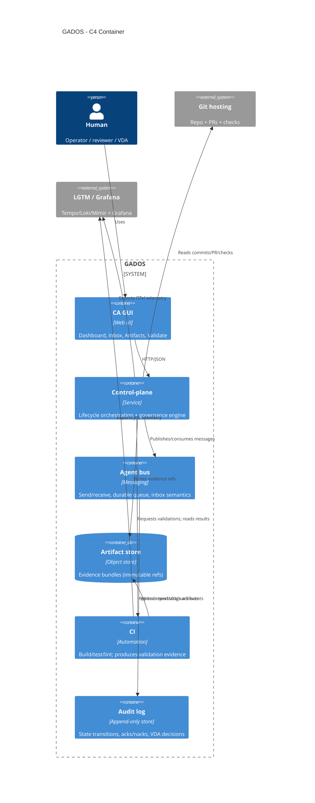
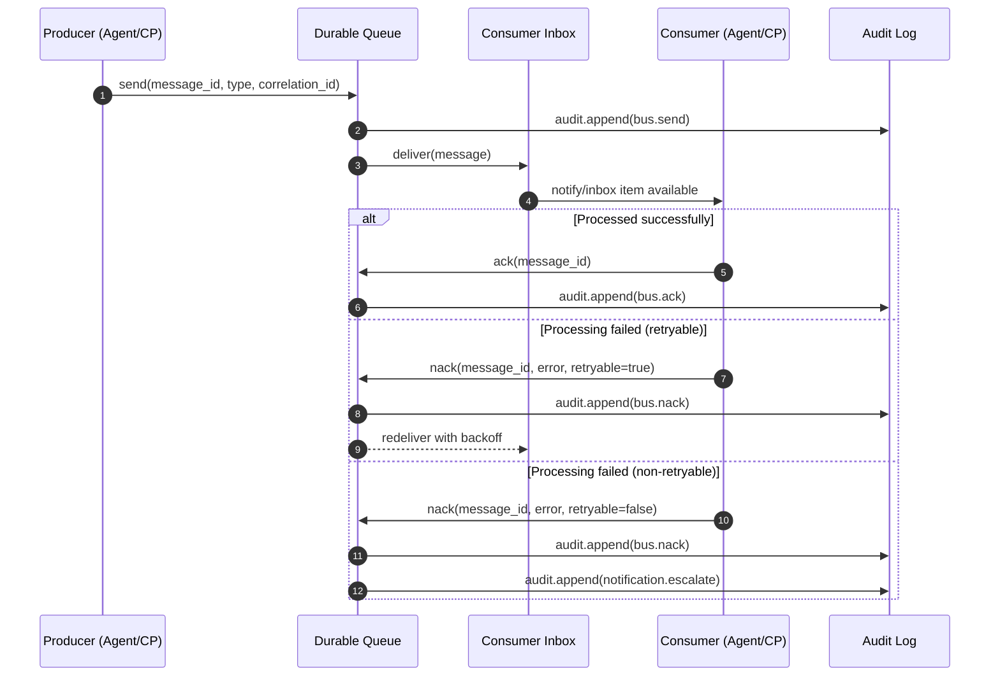

## GADOS architecture (versioned artifact)

This document is the high-level architecture narrative for GADOS and includes the authoritative Mermaid architecture/sequence diagrams used for reviews and audits.

### Overview

GADOS is a lightweight governance system for agent-assisted software delivery. It turns human/agent **intent** into **audit-ready artifacts** and a **VERIFIED** decision backed by evidence (tests, QA outputs, peer review, VDA decision).

Conceptually, GADOS is a **control-plane** that coordinates:

- intents and lifecycle state transitions
- agent work (planner/implementer/validator)
- artifact storage (evidence bundles)
- governance enforcement (separation-of-duties, required checks)
- observability (logs/metrics/traces)

### Major components (conceptual)

- **CA GUI**
  - Human UI for intents, inbox, artifacts, and validation decisions.
- **Control-plane**
  - Orchestrates lifecycle transitions, enforces governance rules, and routes work to agents and CI.
- **Agent bus**
  - Message transport (durable queue + inbox semantics).
- **Artifact store**
  - Durable store for evidence bundles with immutable references (hashes / write-once IDs).
- **CI / Validator**
  - Automated validation producing evidence and status updates.
- **Observability stack (LGTM/Grafana)**
  - Stores traces (Tempo), logs (Loki), metrics (Mimir) and provides query UX (Grafana).

### Audit-ready properties

- **Traceability**: every decision references evidence IDs and audit log entries.
- **Immutability**: evidence artifacts are content-addressed or write-once.
- **Separation of duties**: VERIFIED requires independent peer review and VDA approval.
- **Reproducibility**: validation can be re-run; outputs are preserved.

---

## Mermaid diagrams

### C4 Context



### C4 Container



### Sequence: Story lifecycle (PLANNED → … → VERIFIED)

```mermaid
sequenceDiagram
autonumber
participant H as Human
participant UI as CA GUI
participant CP as Control-plane
participant AG as LangGraph Agents
participant CI as CI/Validator
participant AS as Artifact Store
participant AL as Audit Log
participant VDA as VDA (Human)

H->>UI: Create/confirm INTENT (intent_id)
UI->>CP: intent.created
CP->>AL: audit.append (intent created)

H->>UI: Confirm plan + AC + evidence plan
UI->>CP: plan.created
CP->>AL: audit.append (state=PLANNED)
CP->>AS: artifact.created (plan artifact + hash)

CP->>AG: work.started (dispatch implementer)
AG->>AS: artifact.created (diffs/reports as produced)
AG->>CI: validation.requested (tests/lint)
CI->>AS: artifact.created (test logs + reports)
CI->>CP: validation.completed (pass/fail + evidence refs)
CP->>AL: audit.append (state=VALIDATED or remediation required)

CP->>UI: request peer review
H->>UI: Peer review recorded (approve/changes)
UI->>CP: review.recorded
CP->>AL: audit.append (state=REVIEWED)

CP->>UI: Present evidence bundle + validation results
VDA->>UI: Approve/deny/defer with rationale
UI->>CP: vda.decision.recorded
CP->>AL: audit.append (VDA decision)

alt All governance rules satisfied
  CP->>AL: audit.append (state=VERIFIED + evidence refs)
  CP->>UI: Show VERIFIED badge + links to evidence
else Missing evidence / SoD violation / failed checks
  CP->>UI: Block VERIFIED; show required remediation
  CP->>AL: audit.append (verification blocked)
end
```

### Sequence: Agent bus delivery (send → durable queue → inbox → ack/nack → audit log)



